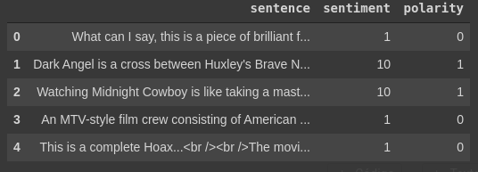

# IMDB Reviews Classification
The aim of this repository is to work with a deep learning approach to predict the sentiment of a movie review, for this attempt we work with a dataset for binary sentiment classification containing large amount of data. 

The dataset used is the IMDB movie review dataset in which a bunch of reviews are given and the classification task is to determine whether a review is positive or not. A review is considered positive if the rating is between 7-10 stars and is negative if the rating is between 0-4 stars. A set of 25,000 highly polar movie reviews for training and 25,000 for testing is used. 

[IMDB](https://www.imdb.com/) is an online database that contains information on movies, television programs, among other related audiovisual content.

You can find the dataset [here](https://ai.stanford.edu/~amaas/data/sentiment/)

### Some reviews examples

> "This was an absolutely terrible movie. Don\'t be lured in by
> Christopher Walken or Michael Ironside. Both are great actors, but
> this must simply be their worst role in history. Even their great
> acting could not redeem this movie\'s ridiculous storyline. This movie
> is an early nineties US propaganda piece. The most pathetic scenes
> were those when the Columbian rebels were making their cases for
> revolutions. Maria Conchita Alonso appeared phony, and her pseudo-love
> affair with Walken was nothing but a pathetic emotional plug in a
> movie that was devoid of any real meaning. I am disappointed that
> there are movies like this, ruining actor\'s like Christopher
> Walken\'s good name. I could barely sit through it."

## Experiments
The models used are:

-   Standard neural network
-   Single Layer LSTM (Bidirectional)
-   2 Layer LSTM (Bidirectional)
-   Bidirectional GRU
-   CNN

this can be seen in [imdb_models_comparison.ipynb](imdb_models_comparison.ipynb)

**Usign Pretrained GloVe Embedding**  
- Hybrid model with CNN-LSTM using dropout

this can be seen in [imdb_models_comparison.ipynb](imdb_models_comparison.ipynb)

**Using tensorflow-hub Pretrained Elmo Embeddings**
- Standard neural network

and this can be seen in [elmo_imdb.ipynb](elmo_imdb.ipynb)

## Results
| Model   				|      Training Acc      |  Testing Acc |
|-----------------------|:---------------------:|-------------:|
| Standard NN			|  	0.5492 	| 	**0.5447**	|
| Vanilla NN			|  	0.8460 	| 	0.8317	|
| Single Layer LSTM 	|	0.8638 	|   0.8253 	|
| 2 Layer LSTM 			| 	0.8484 	|   0.8282 	|
| GRU 					| 	0.8653	|   0.8262 	|
| CNN 					| 	0.7936 	|   0.8314 	|
| CNN-LSTM GloVe 		| 	0.8793 	|   0.8115 	|
| Elmo Standard NN 		| 	0.8270 	|   **0.8231** 	|

***Obtained from the best testing accuracy**

## Conclusions

- It is notorious that the models generally has overfitting, and this could be because we have a dictionary with small amount of words.
- Applying Elmo embedding to a Standard NN generates a big improve in the test accuracy, it's propose to apply Elmo embeddings to other architectures
- The best testing accuracy is similar for almost all the trained architectures, and [here](https://www.kaggle.com/c/imdb-review/leaderboard) you can see the best accuracy in kaggle competition
